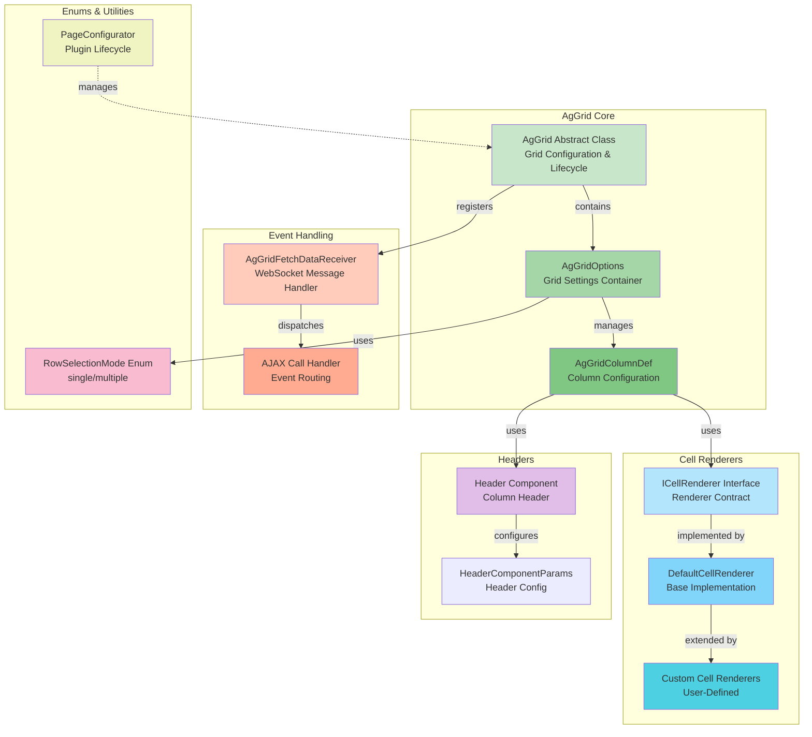

# C4 Level 3: AgGrid Component Architecture

This diagram breaks down the internal structure of the AgGrid plugin and its key components.



## Component Details

### Grid Core Tier

#### `AgGrid<J extends AgGrid<J>>`
- **Role**: Fluent CRTP-based grid component
- **Key Methods**:
  - `fetchData()` — Abstract; returns collection of row data
  - `getRowIdFieldName()` — Abstract; specifies unique row identifier field
  - `setOptions(AgGridOptions)`, `bindRowData()`, `enablePagination()`, etc. — Fluent configuration
  - `setTheme(String)`, `setHeight(String)`, `setWidth(String)` — Styling
  - `addColumnDef()`, `addColumnDefs()` — Column registration
- **Lifecycle Hooks**: `init()` emits Angular attributes, registers WebSocket listeners
- **Annotation Processing**: Decorated with `@NgAfterViewInit`, `@NgOnDestroy`, `@NgComponentReference`, etc.

#### `AgGridOptions<T>`
- **Role**: Configuration container for grid-level settings
- **Key Fields**:
  - `columnDefs: List<AgGridColumnDef>` — Column definitions
  - `rowData: List<Object>` — Initial row data
  - `rowDataRaw: String` — Optional TypeScript expression for dynamic row binding
  - `pagination: Boolean` — Enable pagination
  - `paginationPageSize: Integer` — Rows per page
  - `rowHeight: Integer` — Uniform row height
  - `rowSelection: RowSelectionOptions` — Row selection mode/multi-select
  - `defaultColDef: ColDef` — Default settings for all columns
  - `enableCellChangeFlash: Boolean` — Flash changed cells
- **Serialization**: Converts to JSON for Angular template binding

#### `AgGridColumnDef<T>`
- **Role**: Represents a single grid column
- **Key Fields**:
  - `field: String` — Data property name
  - `headerName: String` — Column title
  - `cellRenderer: ICellRenderer` — Optional custom cell renderer
  - `headerComponent: IComponent` — Optional custom header
  - `headerComponentParams: HeaderComponentParams` — Header configuration
  - Inherited from AG Grid: `sortable`, `filter`, `resizable`, `width`, `hide`, etc.
- **Builder Pattern**: CRTP fluent setters (if applicable) or Bean property setters

---

### Cell Rendering Tier

#### `ICellRenderer<C extends ICellRenderer<C>>`
- **Role**: Contract for custom cell rendering components
- **Extends**: `IComponent` (Angular component interface)
- **Usage**: Assigned to `AgGridColumnDef.cellRenderer`
- **Codegen**: JWebMP emits `@NgComponentReference` for all cell renderers, auto-importing them in Angular

#### `DefaultCellRenderer`
- **Role**: Base implementation for custom renderers
- **Purpose**: Provides common cell rendering logic
- **Extension Point**: Subclass to create domain-specific renderers

#### Custom Cell Renderers
- **Pattern**: `public class MyCustomRenderer extends DefaultCellRenderer<...> implements ICellRenderer<...>`
- **Example**: Date formatters, status badges, action buttons, charts, etc.

---

### Header Customization Tier

#### `HeaderComponent`
- **Role**: Custom header component for a column
- **Pattern**: Implements `IComponent` and `INgComponent`

#### `HeaderComponentParams`
- **Role**: Configuration for header (title, sort icons, etc.)
- **Fields**: `innerHeaderComponent` (nested header), sorting state, etc.

---

### Event Handling Tier

#### `AgGridFetchDataReceiver` (Inner Class)
- **Role**: WebSocket message handler for grid data fetches
- **Lifecycle**: Registered per grid ID in `AgGrid.registerWebSocketListeners()`
- **Method**: `Uni<AjaxResponse<?>> action(AjaxCall call, AjaxResponse response)`
  - Receives `{ listenerName, className }` from client
  - Looks up grid instance via IoC (`IGuiceContext.get(actionClass)`)
  - Calls `MyGrid.fetchData()`
  - Wraps result in `AjaxResponse` and returns
  - Response sent back via WebSocket; client updates rowData

---

### Enums & Utilities

#### `RowSelectionMode`
- **Values**: `SINGLE` (singleRow), `MULTIPLE`
- **Usage**: `getOptions().setRowSelectionMode(RowSelectionMode.MULTIPLE)`

#### `AgGridPageConfigurator` (PageConfigurator Pattern)
- **Role**: Plugin lifecycle manager
- **Methods**: `setEnabled(boolean)` — Enable/disable plugin globally
- **GuicedEE Integration**: Auto-discovered via SPI; no manual wiring needed

---

## Class Hierarchy & Patterns

```
AgGrid<J>
 ├── extends DivSimple<J> (HTML div wrapper)
 ├── implements INgComponent<J> (Angular component interface)
 └── CRTP fluent chaining: public J setHeight(...) return (J) this

AgGridOptions<T>
 ├── Composition: List<AgGridColumnDef<T>>
 ├── Serializable (JSON rendering)
 └── Bean properties (setter/getter)

AgGridColumnDef<T>
 ├── Contains: Optional<ICellRenderer<T>>
 ├── Contains: Optional<IComponent> (header)
 └── Mirrors: AG Grid ColDef structure

ICellRenderer<C>
 ├── extends IComponent<C>
 ├── Implemented by: DefaultCellRenderer
 └── Extended by: Custom user renderers
```

---

## Data Flow: Column Definition & Cell Rendering

```
1. Developer: AgGrid.addColumnDef(new AgGridColumnDef("status", "Status").setCellRenderer(new StatusBadgeRenderer()))
   ↓
2. Initialization: AgGrid.init() iterates columnDefs
   ↓
3. Annotation Detection: Detects StatusBadgeRenderer implements IComponent
   ↓
4. Codegen: Adds @NgComponentReference(StatusBadgeRenderer.class) to generated Angular component
   ↓
5. Angular Bootstrap: Imports StatusBadge component (via generated metadata)
   ↓
6. Column Config: [columnDefs]="[{ field: 'status', ..., cellRenderer: StatusBadge }]"
   ↓
7. Rendering: AG Grid Angular renders cell via StatusBadge component instance
```

---

## Bounded Contexts Mapping

| Context | Components | Responsibility |
|---------|-----------|-----------------|
| **Configuration** | AgGrid, AgGridOptions, AgGridColumnDef | Build and describe grid structure |
| **Rendering** | ICellRenderer, DefaultCellRenderer, Custom renderers | Emit Angular components for cells/headers |
| **Events** | AgGridFetchDataReceiver, AjaxIntegration | Dispatch user actions and data updates |
| **Theming** | CSS classes, style bindings | Visual presentation (ag-theme-alpine, etc.) |

---

## Next: [Grid Initialization Sequence](./sequence-grid-initialization.md)
