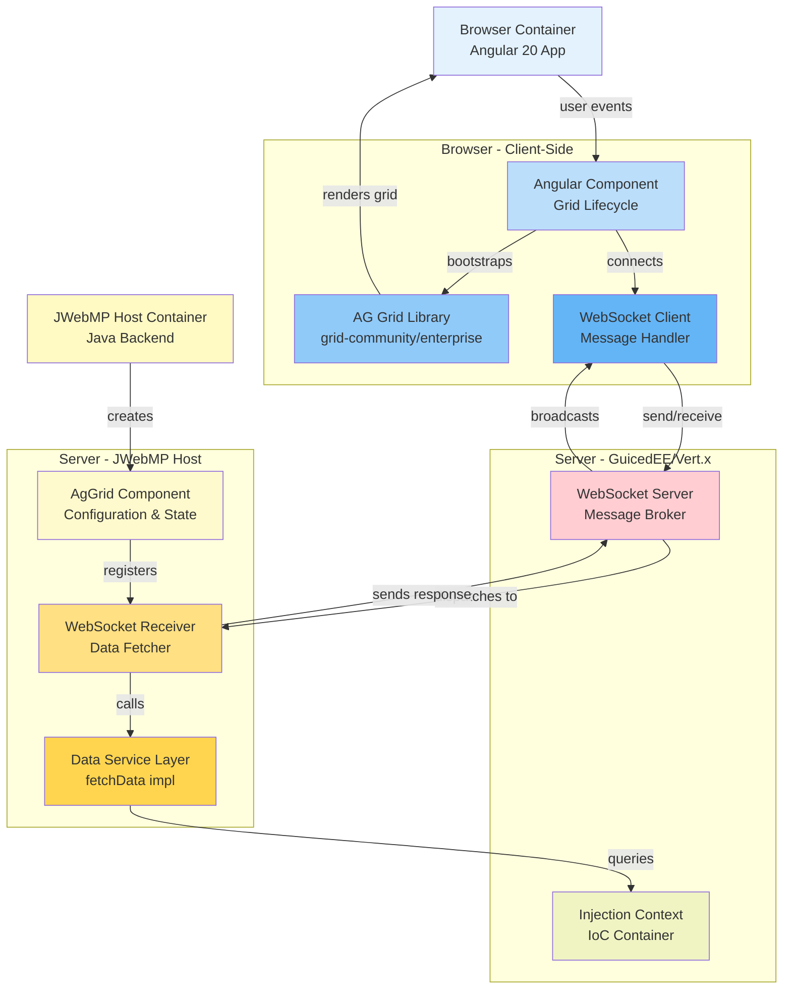

# C4 Level 2: Container Architecture

This diagram details the major containers and internal responsibilities within the AgGrid Plugin ecosystem.



## Container Definitions

### Client-Side (Browser)

| Container | Responsibility |
|-----------|-----------------|
| **Angular Component** | Lifecycle hooks (ngAfterViewInit, ngOnDestroy), event bindings, field updates |
| **AG Grid Library** | Grid rendering, column definitions, row data management, sorting/filtering/pagination |
| **WebSocket Client** | Listens for server-pushed messages, updates grid rowData via GridApi |

### Server-Side (JWebMP + GuicedEE)

| Container | Responsibility |
|-----------|-----------------|
| **AgGrid Component** | Java POJO representing grid configuration; CRTP fluent API for setup |
| **WebSocket Receiver** | Abstract message handler; dispatches to grid's fetchData() on events |
| **Data Service Layer** | Application-specific implementation of fetchData(); queries DB, APIs, etc. |
| **Injection Context** | GuicedEE IoC; resolves grid subclass instances and their dependencies |
| **WebSocket Server** | Vert.x-based server; maintains client connections, routes messages |

---

## Communication Patterns

### 1. Grid Configuration (Server → Client)
```
Server: new MyGrid() { ... }.setHeight("500px").setTheme("ag-theme-alpine") ... }
   ↓
Annotation Processing: @NgImportReference, @NgField, etc. extracted
   ↓
HTML Rendering: <ag-grid-angular [gridOptions]="options" ...>
   ↓
Browser: Angular loads HTML, component initializes
```

### 2. Data Request (Client → Server → Client)
```
Browser: "Grid ready, fetch initial data"
   ↓
WebSocket: Send { listenerName: "gridId", className: "MyGrid" }
   ↓
Server: EventReceiver.action() calls MyGrid.fetchData()
   ↓
Response: AjaxResponse with rowData collection
   ↓
Browser: Receives via WebSocket, AG Grid API updates [rowData]
```

### 3. Event Notification (Client → Server)
```
Browser: User selects row
   ↓
AG Grid: Fires RowSelectedEvent
   ↓
Angular Component: onRowSelectJS() → optional AJAX call
   ↓
Server: Processes selection (may trigger data update loop)
```

---

## Interface Definitions (Key Abstractions)

### Core Component Interface
```java
public abstract class AgGrid<J extends AgGrid<J>> extends DivSimple<J> implements INgComponent<J> {
    public abstract <T extends Collection<T> & IJsonRepresentation<T>> T fetchData();
    public abstract String getRowIdFieldName();
    // CRTP fluent methods: setOptions, bindRowData, enablePagination, etc.
}
```

### Cell Renderer Interface
```java
public interface ICellRenderer<C extends ICellRenderer<C>> extends IComponent<C> {
    // Custom component for grid cell rendering
}
```

### WebSocket Receiver
```java
protected static class AgGridFetchDataReceiver extends WebSocketAbstractCallReceiver<...> {
    @Override
    public Uni<AjaxResponse<?>> action(AjaxCall<?> call, AjaxResponse<?> response) {
        // Invoke fetchData(), wrap result, return response
    }
}
```

---

## Dependency Map

| Layer | Depends On |
|-------|-----------|
| **Client** | AG Grid Angular (npm), Angular 20, RxJS (WebSocket subscriptions) |
| **AgGrid Plugin** | JWebMP Core, GuicedEE Client, Lombok (optional), JSpecify (nullness) |
| **Host App** | AgGrid Plugin (Maven dependency), JWebMP BOM, GuicedEE StandaloneBOM |

---

## Next: [Component Architecture (C4 L3)](./c4-component-aggrid.md)
