# C4 Level 1: System Context

This diagram shows the AgGrid Plugin in the context of the broader JWebMP ecosystem.

```mermaid
graph TB
    Browser["🌐 Web Browser<br/>Angular 20 + AG Grid"]
    User["👤 End User"]
    
    JWebMPApp["JWebMP Host Application<br/>Backend Services"]
    AgGridPlugin["AgGrid Plugin<br/>Grid Component Library"]
    GuicedEE["GuicedEE Client<br/>IoC/WebSocket"]
    VertxServer["Vert.x 5 Server<br/>HTTP/WebSocket"]
    ExternalAPIs["External Services<br/>Data APIs, Auth"]
    
    User -->|uses| Browser
    Browser -->|loads| JWebMPApp
    JWebMPApp -->|embeds| AgGridPlugin
    AgGridPlugin -->|depends on| GuicedEE
    GuicedEE -->|communicates via| VertxServer
    VertxServer -->|serves| Browser
    VertxServer -->|calls| ExternalAPIs
    
    style Browser fill:#E3F2FD
    style User fill:#F0F4C3
    style JWebMPApp fill:#FFF9C4
    style AgGridPlugin fill:#F1F8E9
    style GuicedEE fill:#E0F2F1
    style VertxServer fill:#FFEBEE
    style ExternalAPIs fill:#F3E5F5
```

## Context Summary

| Element | Role | Interaction |
|---------|------|-------------|
| **End User** | Interacts with grids in the browser | Selects rows, sorts, filters, paginates |
| **Web Browser** | Angular 20 + AG Grid Community/Enterprise | Renders grid UI, handles user input, WebSocket messages |
| **JWebMP Host App** | Server-side Java application | Hosts AgGrid plugin, provides data, manages WebSocket receivers |
| **AgGrid Plugin** | This library | Bridges Java grid configuration to Angular via annotations |
| **GuicedEE Client** | Lightweight IoC container + WebSocket | Enables server-pushed grid updates, dependency injection |
| **Vert.x 5 Server** | Reactive HTTP/WebSocket backbone | Serves HTML/CSS/JS, handles WebSocket connections |
| **External Services** | Data sources, authentication, APIs | Invoked by JWebMP host to populate grid data |

---

## Key Flows (High-Level)

### 1. Grid Initialization
1. JWebMP host creates a grid subclass (extends `AgGrid`)
2. Annotations on the grid generate Angular component metadata
3. Host renders HTML with `<ag-grid-angular>` tag
4. Browser loads HTML, Angular bootstrap activates the grid
5. WebSocket listener registered for grid's unique ID

### 2. Real-Time Data Updates
1. Server-side event triggers (e.g., data change, filter applied)
2. Server fetches updated data via grid's `fetchData()` method
3. Server sends `AjaxResponse` with new rows via WebSocket
4. Browser receives message, AG Grid API updates rowData
5. Grid re-renders affected rows

### 3. User Interaction (e.g., Row Selection)
1. User clicks row in browser
2. AG Grid `RowSelectedEvent` fires
3. Client-side handler calls server via AJAX (if configured)
4. Server processes selection, may trigger data update flow (#2)

---

## Trust Boundaries & Security

- **Client-Side**: Browser + Angular code (user-controlled, untrusted for server decisions)
- **Server-Side**: JWebMP + GuicedEE + Vert.x (authoritative, validates grid requests)
- **Transport**: WebSocket + TLS (encrypted in production)
- **Validation**: Server must validate all grid filter/sort/pagination requests

---

## Next: [Container Architecture (C4 L2)](./c4-container.md)
