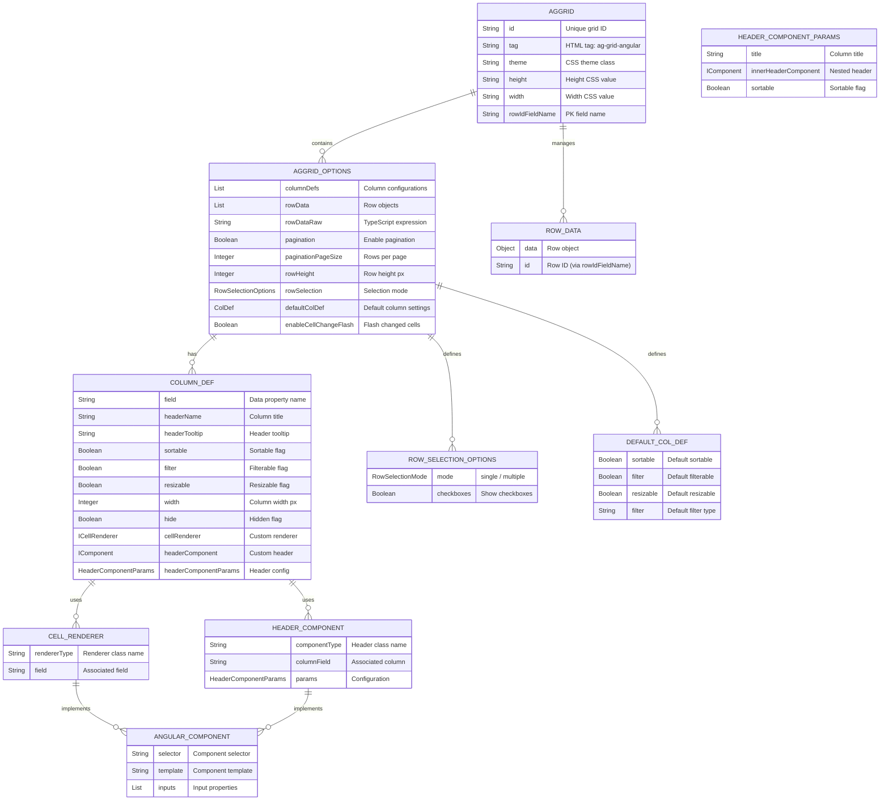

# Entity-Relationship Diagram: AgGrid Domain Model

This diagram illustrates the domain model and key relationships for grid configuration and data binding.



## Domain Model Definitions

### Grid (AGGRID)
| Field | Type | Purpose |
|-------|------|---------|
| `id` | String | Unique identifier; used for WebSocket listener registration |
| `tag` | String | Always "ag-grid-angular" for Angular integration |
| `theme` | String | CSS class (e.g., "ag-theme-alpine", "ag-theme-balham") |
| `height` | String | CSS height (e.g., "500px", "100%") |
| `width` | String | CSS width (e.g., "100%", "800px") |
| `rowIdFieldName` | String | Property name that uniquely identifies rows (PK field) |

### Grid Options (AGGRID_OPTIONS)
| Field | Type | Purpose |
|-------|------|---------|
| `columnDefs` | List<AgGridColumnDef> | Array of column configurations |
| `rowData` | List<Object> | Array of row data objects (initial or from fetchData) |
| `rowDataRaw` | String | TypeScript expression for dynamic row binding (alternative to rowData) |
| `pagination` | Boolean | Enable/disable pagination |
| `paginationPageSize` | Integer | Number of rows per page |
| `rowHeight` | Integer | Uniform row height in pixels |
| `rowSelection` | RowSelectionOptions | Row selection mode (single/multiple) and checkbox visibility |
| `defaultColDef` | ColDef | Default settings applied to all columns |
| `enableCellChangeFlash` | Boolean | Flash cells when values change |

### Column Definition (COLUMN_DEF)
| Field | Type | Purpose |
|-------|------|---------|
| `field` | String | Property name in row data object |
| `headerName` | String | Column title displayed in header |
| `headerTooltip` | String | Tooltip on hover (optional) |
| `sortable` | Boolean | Allow column sorting |
| `filter` | Boolean | Show filter control |
| `resizable` | Boolean | Allow column resizing |
| `width` | Integer | Fixed or initial column width in pixels |
| `hide` | Boolean | Hide column (still exists in data, just not shown) |
| `cellRenderer` | ICellRenderer | Optional custom cell component |
| `headerComponent` | IComponent | Optional custom header component |
| `headerComponentParams` | HeaderComponentParams | Configuration for header component |

### Cell Renderer (CELL_RENDERER)
| Field | Type | Purpose |
|-------|------|---------|
| `rendererType` | String | Fully-qualified class name of renderer implementation |
| `field` | String | Associated column field (for context) |

**Lifecycle**: Cell renderers are injected into AG Grid as Angular components. JWebMP codegen automatically emits `@NgComponentReference` for all renderers.

### Header Component (HEADER_COMPONENT)
| Field | Type | Purpose |
|-------|------|---------|
| `componentType` | String | Fully-qualified class name |
| `columnField` | String | Associated column field |
| `params` | HeaderComponentParams | Configuration (title, nested header, sort state) |

### Row Selection Options (ROW_SELECTION_OPTIONS)
| Field | Type | Purpose |
|-------|------|---------|
| `mode` | RowSelectionMode | SINGLE (singleRow) or MULTIPLE |
| `checkboxes` | Boolean | Display checkboxes for row selection |

### Row Data (ROW_DATA)
| Field | Type | Purpose |
|-------|------|---------|
| `data` | Object | Plain POJO or serializable object |
| `id` | String (derived) | Row ID extracted via `rowIdFieldName` from data object |

---

## Relationship Rules

1. **Grid → Options (1:1)**
   - Every AgGrid instance has exactly one AgGridOptions instance
   - Options container holds all grid-level settings

2. **Options → Columns (1:N)**
   - One grid can have many columns
   - Order in list determines column order in UI

3. **Column → Cell Renderer (0..1)**
   - Columns may or may not have a custom cell renderer
   - If absent, AG Grid uses default rendering

4. **Column → Header Component (0..1)**
   - Columns may have a custom header
   - If absent, AG Grid uses default header (title only)

5. **Options → Row Selection (1:1)**
   - Row selection is a grid-level setting (single/multiple)

6. **Options → Default Column (1:1)**
   - Default column definition applied to all columns unless overridden

7. **Grid → Row Data (1:N)**
   - Grid manages a collection of row objects
   - Each row object is identified by its rowIdFieldName property

---

## Data Binding Contracts

### Binding: ColumnDefs
```java
List<AgGridColumnDef<?>> columnDefs = grid.getOptions().getColumnDefs();
// Serialized to JSON array: [{ field: "name", headerName: "Name", ... }, ...]
// Bound in Angular: [columnDefs]="columnDefs"
```

### Binding: RowData
```java
// Option A: From collection
List<Object> rowData = new ArrayList<>();
rowData.add(new Person("John", 30));
grid.getOptions().setRowData(rowData);
// Serialized to JSON array: [{ name: "John", age: 30 }, ...]

// Option B: From TypeScript expression
grid.getOptions().setRowDataRaw("this.myDataSource$");
// Bound in Angular: [rowData]="this.myDataSource$"
```

### Binding: Row ID Function
```java
// AG Grid API: getRowId: (params: GetRowIdParams) => string
// In component fields: getRowId: GetRowIdFunc = (params) => String(params.data.id);
// Allows efficient row updates and selection tracking
```

---

## Event & Update Patterns

### Pattern 1: Initial Load
```
Grid.init() → Options.getColumnDefs() → [columnDefs]="columnDefs"
         → fetchData() → AjaxResponse.rowData → [rowData]="rowData"
```

### Pattern 2: Reactive Update
```
Row Selection Event → onRowSelectJS() → (optional) AJAX call
                   → Server triggers data fetch
                   → WebSocket broadcasts new rowData
                   → Client: AG Grid API.setGridOption('rowData', newRows)
```

### Pattern 3: Inline Binding
```
Grid.getOptions().setRowDataRaw("myDataSource$")
                   → [rowData]="myDataSource$"
                   → RxJS Observable subscription in Angular component
```

---

## Validation & Constraints

| Constraint | Enforced By |
|------------|-------------|
| rowIdFieldName must exist in row data | Server (fetchData() contract) |
| columnDefs.field must map to row data property | Developer (configuration) |
| cellRenderer must implement IComponent | Java compiler + code review |
| defaultColDef applied only if columnDefs defined | AG Grid logic |
| pagination + paginationPageSize both set or both null | Options validation (optional) |

---

## Next Steps

1. Review [PACT.md](../PACT.md) for product intent and NRRs
2. Study [RULES.md](../RULES.md) for technology-specific constraints
3. Check [GUIDES.md](../GUIDES.md) for how-to examples
4. Refer to [IMPLEMENTATION.md](../IMPLEMENTATION.md) for code locations
