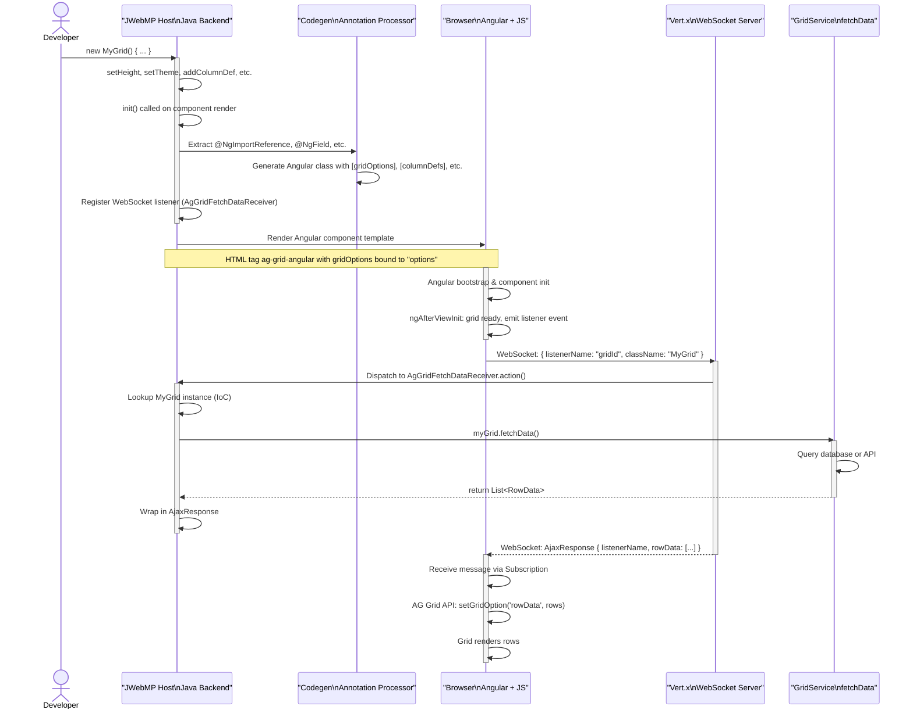
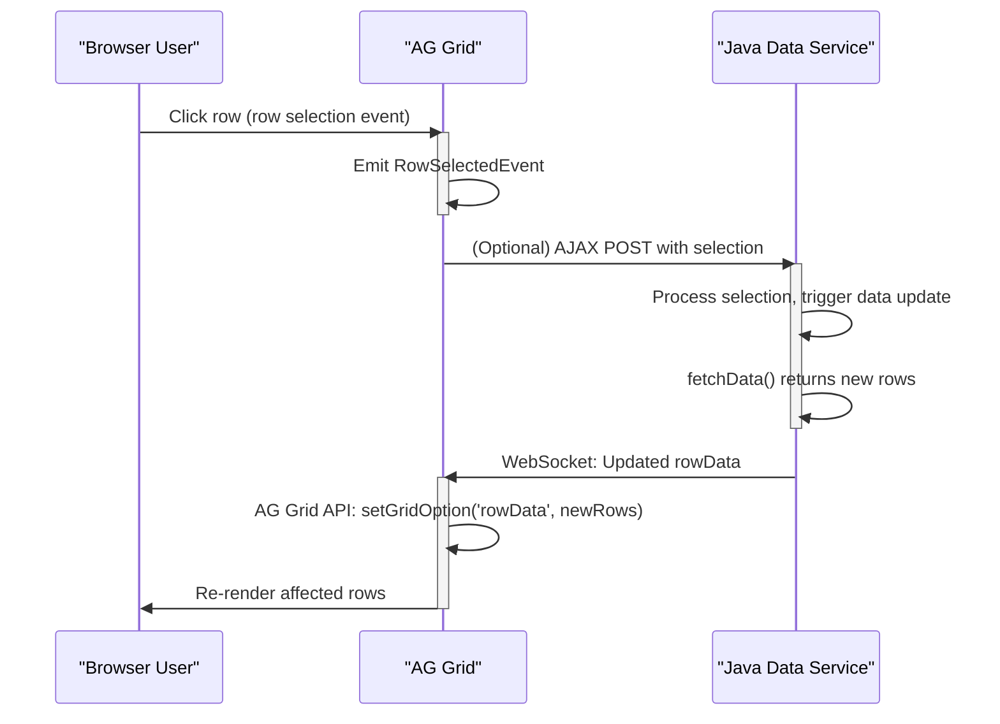

# Sequence Diagram: Grid Initialization

This diagram illustrates the key steps when a grid component is first created, initialized, and rendered.



## Detailed Steps

### 1. Server-Side Component Creation (Java)
- **Trigger**: Developer instantiates `new MyGrid() { ... }`
- **Actions**:
  - CRTP fluent methods build configuration (e.g., `setHeight("500px")`)
  - `init()` is called during component lifecycle
  - JWebMP annotation processor extracts metadata
  - WebSocket listener registered via `IGuicedWebSocket.addWebSocketMessageReceiver()`
  - HTML with `<ag-grid-angular>` and Angular bindings emitted

### 2. Annotation Processing
- **Components Detected**:
  - `@NgImportReference` → imports for AG Grid module, ColDef, GridApi, etc.
  - `@NgComponentReference` → component references for cell/header renderers
  - `@NgField` → TypeScript field declarations (columnDefs, rowData, defaultColDef, etc.)
  - `@NgAfterViewInit` → hook to emit grid ready event
  - `@NgOnDestroy` → hook to unregister listeners
- **Output**: Generated Angular component class with typed fields and bindings

### 3. Client-Side Initialization
- **Trigger**: Browser loads HTML, Angular bootstrap begins
- **Actions**:
  - Angular component `ngAfterViewInit()` fires
  - `eventBusService.send()` emits grid ready signal with listenerName and className
  - Component creates WebSocket subscription for data updates
  - AG Grid Angular component initializes, ready to receive gridOptions

### 4. Initial Data Fetch (WebSocket)
- **Trigger**: Grid ready signal received by client
- **Actions** (Client):
  - Send `{ listenerName: "gridId", className: "com.jwebmp.plugins.aggrid.MyGrid" }` via WebSocket
- **Actions** (Server):
  - `AgGridFetchDataReceiver.action()` intercepts message
  - Calls `myGrid.fetchData()` (application-specific implementation)
  - Wraps result (List of row objects) in `AjaxResponse`
- **Actions** (Client):
  - WebSocket subscription receives `AjaxResponse`
  - `AG Grid API.setGridOption('rowData', rows)` updates grid
  - Grid renders received rows

### 5. Grid Rendering
- **AG Grid Angular**: Takes [gridOptions], [columnDefs], [rowData] and renders table
- **Cell Renderers**: For each column with cellRenderer, instantiate and inject component
- **Event Listeners**: Attach row selection, cell value change, etc. listeners

---

## Reactive Data Updates (WebSocket Flow)



---

## Error Scenarios

### Scenario A: Grid Fetch Fails
```
Server → AgGridFetchDataReceiver.action() throws exception
  ↓
Exception logged, response returned with error flag
  ↓
Client receives error, may display toast/alert
```

### Scenario B: WebSocket Disconnects
```
Connection lost during data update
  ↓
Client subscription error handler triggered
  ↓
May retry or queue request for reconnection
```

### Scenario C: Grid Destroyed Before Update
```
User navigates away, ngOnDestroy called
  ↓
@NgOnDestroy emits unregister event
  ↓
Server-side listener removed, no further updates sent
```

---

## Key Takeaways

1. **Separation of Concerns**: Server builds grid config (Java) → Client renders (Angular)
2. **Real-Time Updates**: WebSocket enables server to push data updates to client
3. **Fluent Configuration**: CRTP pattern enables expressive, chainable setup
4. **Component Composition**: Cell renderers are first-class Angular components with full lifecycle
5. **Error Resilience**: Exception handling at multiple layers (server, WebSocket, client)

---

## Next: [Domain Model & Relationships (ERD)](./erd-domain.md)
